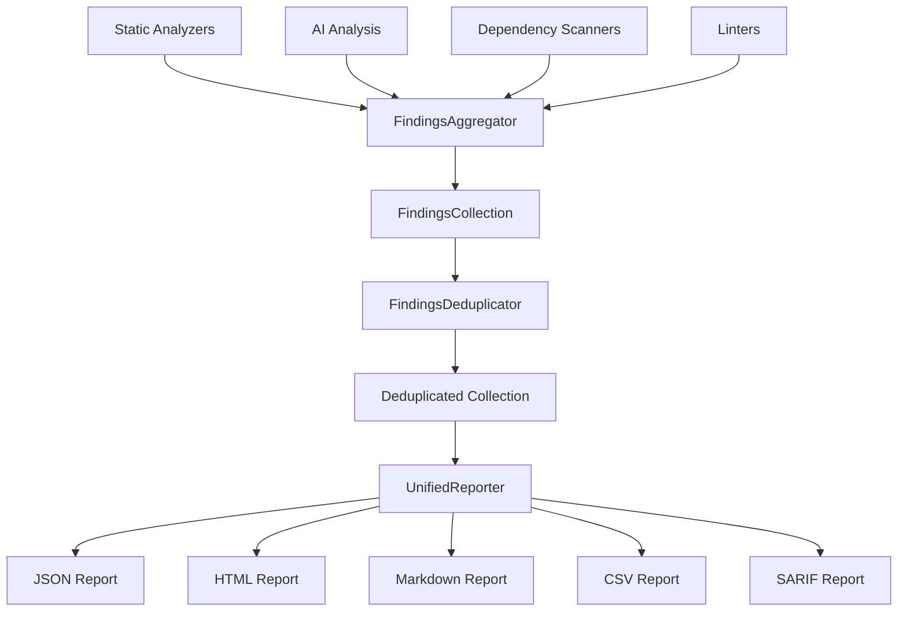

# Unified Findings Aggregation System

## Overview

The Unified Findings Aggregation System is a comprehensive solution for merging, deduplicating, and reporting findings from multiple code analysis sources in a consistent format. This system is designed to handle results from:

- **Static analyzers** (pylint, flake8, mypy, etc.)
- **AI-powered analysis** (Claude pattern recognition)
- **Dependency analysis** (vulnerability scanners, outdated packages)
- **Security scanners** (bandit, semgrep)
- **Custom analyzers**

## Key Features

### 🔄 Multi-Source Aggregation
- **Unified data model** for all finding types
- **Source normalization** with intelligent type mapping
- **Metadata preservation** from original tools
- **Confidence scoring** for AI-generated findings

### 🔍 Intelligent Deduplication
- **Location-based matching** with configurable tolerance
- **Content similarity detection** using multiple strategies
- **Rule ID correlation** across different tools
- **Type compatibility grouping** for related findings

### 📊 Severity Scoring and Prioritization
- **Consistent severity levels** (Info, Low, Medium, High, Critical)
- **Impact assessment** (low, medium, high, critical)
- **Effort estimation** for remediation
- **Automatic severity scoring** based on finding type and source

### 📝 Multi-Format Reporting
- **JSON** - Structured data for API consumption
- **HTML** - Rich interactive web reports with filtering
- **Markdown** - Documentation-friendly format
- **CSV** - Tabular data for spreadsheet analysis
- **SARIF** - Static Analysis Results Interchange Format
- **Text** - Concise summaries for CI/CD integration

## Architecture

### Core Components

```
wtf_codebot/findings/
├── __init__.py          # Package exports
├── models.py           # Data models and enums
├── aggregator.py       # Multi-source aggregation
├── deduplicator.py     # Duplicate detection and merging
└── reporter.py         # Multi-format reporting
```

### Data Flow



## Usage Examples

### Basic Aggregation

```python
from wtf_codebot.findings import (
    FindingsAggregator, FindingsDeduplicator, UnifiedReporter
)

# Initialize aggregator
aggregator = FindingsAggregator()

# Add findings from different sources
aggregator.add_static_analysis_results(static_results, "pylint")
aggregator.add_ai_analysis_results(ai_results, "claude")
aggregator.add_dependency_analysis_results(dependency_results)

# Get aggregated collection
collection = aggregator.get_findings_collection()

# Deduplicate findings
deduplicator = FindingsDeduplicator(location_tolerance=2)
deduplicated = deduplicator.deduplicate_findings(collection)

# Generate reports
reporter = UnifiedReporter()
reporter.generate_html_report(deduplicated, "./report.html")
reporter.generate_json_report(deduplicated, "./report.json")
```

### Linter Integration

```python
from wtf_codebot.findings.aggregator import parse_pylint_output

# Parse linter output
pylint_output = subprocess.check_output(["pylint", "myfile.py"])
parsed_findings = parse_pylint_output(pylint_output)

# Add to aggregator
aggregator.add_linter_results(
    output=pylint_output,
    file_path="myfile.py",
    tool_name="pylint",
    parser_func=parse_pylint_output
)
```

### Custom Findings

```python
from wtf_codebot.findings import (
    UnifiedFinding, SourceLocation, FindingType, 
    FindingSeverity, FindingSource
)

# Create custom finding
custom_finding = UnifiedFinding(
    title="Custom Security Issue",
    description="Detected potential security vulnerability",
    finding_type=FindingType.SECURITY_VULNERABILITY,
    severity=FindingSeverity.HIGH,
    source=FindingSource.CUSTOM,
    tool_name="my_security_scanner",
    location=SourceLocation(
        file_path="/src/auth.py",
        line_start=42,
        function_name="authenticate"
    ),
    message="Potential authentication bypass",
    suggestion="Add input validation"
)

aggregator.add_custom_finding(custom_finding)
```

### Filtered Reporting

```python
# Report only critical and high severity findings
critical_reporter = UnifiedReporter(
    severity_filter=[FindingSeverity.CRITICAL, FindingSeverity.HIGH]
)

critical_report = critical_reporter.generate_json_report(collection)
```

## Data Models

### UnifiedFinding

The core data structure representing a single finding:

```python
@dataclass
class UnifiedFinding:
    # Core identification
    id: str
    title: str
    description: str
    
    # Classification
    finding_type: FindingType        # CODE_SMELL, SECURITY_VULNERABILITY, etc.
    severity: FindingSeverity        # INFO, LOW, MEDIUM, HIGH, CRITICAL
    confidence: float                # 0.0 to 1.0 (for AI findings)
    
    # Source information
    source: FindingSource           # STATIC_ANALYZER, AI_ANALYSIS, etc.
    tool_name: str                 # "pylint", "claude", etc.
    rule_id: Optional[str]         # Rule/pattern identifier
    
    # Location
    location: SourceLocation       # File, lines, function, class
    
    # Content and context
    affected_code: Optional[str]    # Code snippet
    message: str                   # Primary message
    suggestion: str                # Remediation suggestion
    fix_recommendation: str        # Detailed fix instructions
    
    # Additional data
    metadata: Dict[str, Any]       # Tool-specific metadata
    tags: Set[str]                 # Categorization tags
    
    # Analysis information
    detected_at: datetime          # When finding was detected
    impact: str                    # Impact assessment
    effort_to_fix: str            # Effort estimation
    
    # Relationships
    related_findings: List[str]    # Related finding IDs
    duplicate_of: Optional[str]    # Original finding ID if duplicate
```

### Finding Types

```python
class FindingType(Enum):
    # Code Quality
    CODE_SMELL = "code_smell"
    DESIGN_PATTERN = "design_pattern"
    ANTI_PATTERN = "anti_pattern"
    CYCLOMATIC_COMPLEXITY = "cyclomatic_complexity"
    MAINTAINABILITY = "maintainability"
    
    # Security
    SECURITY_VULNERABILITY = "security_vulnerability"
    AUTHENTICATION_ISSUE = "authentication_issue"
    AUTHORIZATION_ISSUE = "authorization_issue"
    INPUT_VALIDATION = "input_validation"
    CRYPTOGRAPHY_ISSUE = "cryptography_issue"
    
    # Performance
    PERFORMANCE_ISSUE = "performance_issue"
    MEMORY_LEAK = "memory_leak"
    INEFFICIENT_ALGORITHM = "inefficient_algorithm"
    
    # Dependencies
    OUTDATED_DEPENDENCY = "outdated_dependency"
    VULNERABLE_DEPENDENCY = "vulnerable_dependency"
    LICENSE_ISSUE = "license_issue"
    UNUSED_DEPENDENCY = "unused_dependency"
    
    # Syntax & Style
    SYNTAX_ERROR = "syntax_error"
    STYLE_VIOLATION = "style_violation"
    FORMATTING_ISSUE = "formatting_issue"
    NAMING_CONVENTION = "naming_convention"
```

## Deduplication Strategy

The deduplication system uses multiple strategies to identify similar findings:

### 1. Exact Location Matching
- Same file, line, and column
- Same rule ID or pattern name

### 2. Proximity Matching
- Same file within configurable line tolerance (default: 2 lines)
- Same or compatible finding types
- Similar content (title, message)

### 3. Type Compatibility
Related finding types are grouped for potential merging:
- **Security types**: vulnerabilities, authentication, authorization, etc.
- **Quality types**: code smells, anti-patterns, maintainability
- **Style types**: formatting, naming conventions, style violations
- **Dependency types**: outdated, vulnerable, unused dependencies

### 4. Content Similarity
- Title substring matching
- Message content comparison
- Rule ID correlation across tools

## Report Formats

### JSON Report Structure

```json
{
  "metadata": {
    "generated_at": "2025-07-05T16:14:35.926322",
    "tool": "wtf-codebot unified reporter",
    "version": "1.0.0",
    "total_findings": 12
  },
  "summary": {
    "total": 12,
    "severity_counts": {
      "critical": 1,
      "high": 1,
      "medium": 8,
      "low": 1,
      "info": 1
    },
    "type_counts": {
      "code_smell": 2,
      "security_vulnerability": 1,
      "design_pattern": 1
    },
    "source_counts": {
      "static_analyzer": 1,
      "ai_analysis": 2,
      "linter": 7
    },
    "affected_files_count": 6
  },
  "findings": [...]
}
```

### HTML Report Features

- **Interactive filtering** by severity and type
- **Color-coded severity** indicators
- **Collapsible finding details**
- **Responsive design** for mobile/desktop
- **Source code highlighting** for affected code

### SARIF Compliance

The system generates SARIF 2.1.0 compliant reports for integration with:
- GitHub Security Tab
- Azure DevOps
- Other SARIF-compatible tools

## Configuration

### Deduplication Settings

```python
deduplicator = FindingsDeduplicator(
    location_tolerance=2,        # Line number tolerance
    similarity_threshold=0.8     # Content similarity threshold
)
```

### Reporter Options

```python
reporter = UnifiedReporter(
    include_source_locations=True,   # Include location details
    include_metadata=True,           # Include tool metadata
    severity_filter=[                # Filter by severity
        FindingSeverity.HIGH,
        FindingSeverity.CRITICAL
    ]
)
```

## Integration Examples

### CI/CD Pipeline Integration

```yaml
# GitHub Actions example
- name: Run Code Analysis
  run: |
    python -m wtf_codebot.cli analyze --output-format sarif > results.sarif
    
- name: Upload SARIF
  uses: github/codeql-action/upload-sarif@v2
  with:
    sarif_file: results.sarif
```

### IDE Integration

The system can be integrated with IDEs through:
- **Language Server Protocol (LSP)** for real-time findings
- **JSON output** for IDE plugin consumption
- **SARIF format** for IDE security integration

## Performance Considerations

- **Memory efficient** streaming for large codebases
- **Parallel processing** support for multiple files
- **Incremental analysis** with finding caching
- **Configurable batch sizes** for AI analysis

## Extension Points

### Custom Finding Sources

```python
class CustomAnalyzer(BaseAnalyzer):
    def analyze_file(self, file_node):
        # Custom analysis logic
        findings = self.run_custom_analysis(file_node)
        
        # Convert to unified findings
        unified_findings = []
        for finding in findings:
            unified = self.convert_to_unified(finding)
            unified_findings.append(unified)
            
        return unified_findings
```

### Custom Report Formats

```python
class CustomReporter(UnifiedReporter):
    def generate_custom_report(self, collection, output_path=None):
        # Custom report generation logic
        report_content = self.create_custom_format(collection)
        
        if output_path:
            with open(output_path, 'w') as f:
                f.write(report_content)
                
        return report_content
```

## Best Practices

### 1. Source Prioritization
Configure source priority to prefer more reliable tools:
```python
aggregator._source_priority = {
    FindingSource.SECURITY_SCANNER: 5,    # Highest priority
    FindingSource.AI_ANALYSIS: 4,
    FindingSource.DEPENDENCY_ANALYSIS: 3,
    FindingSource.STATIC_ANALYZER: 2,
    FindingSource.LINTER: 1               # Lowest priority
}
```

### 2. Severity Mapping
Implement consistent severity mapping across tools:
- Map tool-specific severities to unified levels
- Consider impact and exploitability for security findings
- Use confidence scores for AI-generated findings

### 3. Metadata Preservation
Preserve important tool-specific metadata:
- CVE IDs for security vulnerabilities
- Performance metrics for performance issues
- Evidence and reasoning for AI findings

### 4. Incremental Processing
For large codebases:
- Process files in batches
- Cache findings between runs
- Only reanalyze changed files

## Demo and Testing

Run the demo script to see the system in action:

```bash
python demo_unified_findings.py
```

This will:
1. Create sample findings from multiple sources
2. Demonstrate deduplication
3. Generate reports in all supported formats
4. Show filtering and customization options

The demo generates reports in the `./reports/` directory:
- `unified_findings.json` - JSON format
- `unified_findings.html` - Interactive HTML report
- `unified_findings.md` - Markdown documentation
- `unified_findings.csv` - Tabular data
- `unified_findings.sarif` - SARIF format

## Future Enhancements

### Planned Features
- **Machine learning** for improved deduplication
- **Trend analysis** across multiple runs
- **Risk scoring** based on finding combinations
- **Automated fix suggestions** using AI
- **Integration APIs** for common tools

### Roadmap
1. **Q3 2025**: ML-based deduplication and severity scoring
2. **Q4 2025**: Advanced trend analysis and historical tracking
3. **Q1 2026**: Automated fix generation and validation
4. **Q2 2026**: Extended tool ecosystem integration

## Contributing

The unified findings system is designed to be extensible. Contributions are welcome for:
- New finding source integrations
- Additional report formats
- Improved deduplication algorithms
- Performance optimizations

See the main project documentation for contribution guidelines.

---

**Note**: This system is part of the larger WTF-Codebot project and integrates seamlessly with existing analyzers and pattern recognition capabilities.
